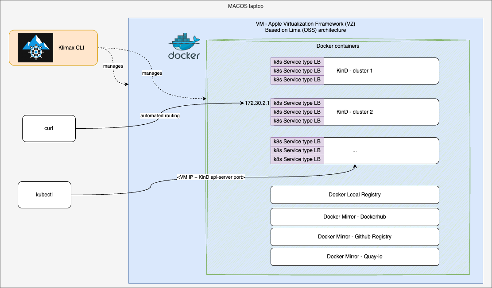

<p align="center">
  
</p>

<p align="center">
  <a href="https://klimax.dev"><strong>🌐 klimax.dev</strong></a>
</p>

_Fast, efficient, and opinionated multi-cluster manager for macOS Silicon laptops._

**klimax** is an dependency-free CLI that manages a macOS Virtualization.framework (VZ) Lima VM, installs Docker inside it, creates and manages multiple [kind](https://kind.sigs.k8s.io/) clusters, and wires up pure L3 routing from your Mac into the kind bridge subnet — no SNAT, no VPN, direct IP access to pods and LoadBalancer services.

Klimax is self-contained, clean, and can work alongside your current Docker setup without conflict (Orbstack, Colima, Rancher Desktop, etc.). More details below.



For lower-level design, see [docs/KLIMAX-LLD-architecture.png](docs/KLIMAX-LLD-architecture.png).

---

## Table of contents
- [Demo](#demo)
- [Prerequisites](#prerequisites)
- [Installation](#installation)
- [Quick start](#quick-start)
- [What it does](#what-it-does)
- [Configuration reference](#configuration-reference)
- [CLI reference](#cli-reference)
- [Networking deep-dive](#networking-deep-dive)
- [Running alongside Rancher Desktop, Colima, or kind-on-lima](#running-alongside-rancher-desktop-colima-or-kind-on-lima)
- [Project layout](#project-layout)


---

## Demo

[](https://asciinema.org/a/oNo5GJ5uj96JE0G2?speed=1.5&autoplay=1)

---

## Prerequisites

### On your Mac (host)

- **macOS 13 Ventura or later** — Apple Virtualization.framework is required (`vmType: vz`)
- **`sudo` access** — needed only when `klimax up` first adds the macOS route (re-runs skip it if already correct) and for `klimax destroy`; `klimax down` does not require sudo
- **Go 1.22+** — only if building from source; not needed for the pre-built binary
- **kubectx** (optional) — for easier kubeconfig context switching, or use `klimax kubeconfig use <name>`

> klimax is self-contained. On first `klimax up` it automatically downloads and caches the Lima guest agent binary. No separate Lima installation required.

### Inside the VM (auto-provisioned by `klimax up`)

| Tool | Version | Purpose |
|---|---|---|
| Docker | latest via get.docker.com | Container runtime for kind and registries |
| kind | v0.31.0 | Kubernetes-in-Docker cluster manager |
| kubectl | latest stable | Cluster management from within the VM |
| jq, iptables, curl, net-tools, python3 | distro packages | Tooling for scripts and routing rules |

---

## Installation

### Homebrew (recommended)

```sh
brew tap bcollard/klimax
brew trust --tap bcollard/klimax
brew install --cask klimax
```

### Upgrading

```sh
brew upgrade --cask klimax
```

> ⚠️ **Rebuild the VM after upgrading.** klimax bakes a specific kind CLI and
> default Kubernetes node image into the VM at creation time; upgrading the binary
> does **not** re-provision an existing VM. After a `brew upgrade`, run:
>
> ```sh
> klimax destroy && klimax up
> ```
>
> then recreate your clusters (`klimax cluster create <name>`). Skipping this can
> leave you on an older kind that cannot create the new default node version.

### Build from source

CGO is required because Lima's VM management packages link against macOS frameworks:

```sh
git clone https://github.com/bcollard/klimax
cd klimax
CGO_ENABLED=1 go build -o klimax ./cmd/klimax
sudo mv klimax /usr/local/bin/
```

### Shell completion

```sh
# zsh (add to ~/.zshrc for persistence)
source <(klimax completion zsh)

# bash
source <(klimax completion bash)

# fish
klimax completion fish > ~/.config/fish/completions/klimax.fish
```

---

## Quick start

```sh
# 1. Bring up the VM + Docker + networking + registries
klimax up # prompts for sudo once to add the macOS route; re-running up on a live VM skips it and won't prompt again

# 2. Create a kind cluster
klimax cluster create dev

# 3. Use the cluster (kubeconfig auto-merged into ~/.kube/config)
kubectl config use-context dev
# or: kubectx dev

# 4. Test cluster connectivity by deploying nginx and exposing it with a LoadBalancer service (MetalLB will assign a VIP in the kind bridge subnet)
klimax cluster e2e-test-nginx
# additionally, you can run a curl command from your Mac directly to the MetalLB VIP without port-forwarding:
# kubectl get svc nginx -o jsonpath='{.status.loadBalancer.ingress[0].ip}' # get VIP; by default in the 172.30.0.0/16 subnet
# curl http://<VIP>/ # should return the nginx welcome page

# 5. Create a second cluster
klimax cluster create staging

# 6. List all clusters
klimax cluster list

# 7. Delete one or more clusters
klimax cluster delete # with interactive picker (space to select)

# 8. Stop the VM when you're done (preserves clusters and registry cache)
klimax down

# 9. Destroy the VM and all clusters when you no longer need them
klimax destroy # this also removes the macOS route, so sudo is required
```

After `klimax up`, the kind bridge CIDR is routed from your Mac directly to the VM. You can reach any pod IP, Service ClusterIP, or MetalLB LoadBalancer IP without port-forwarding.


---

## What it does

| Concern | What klimax does |
|---|---|
| VM | Creates/starts/stops/deletes a Lima VZ instance |
| Docker | Installs Docker in the VM; forwards the socket to `~/.<vmname>.docker.sock` |
| kind | Creates/deletes multiple kind clusters; each gets its own subnet slice and API port |
| Registries | Runs a local push registry (`kind-registry:5000`) + pull-through mirrors for docker.io, quay.io, gcr.io; mirror data cached persistently |
| Networking | Routes `kindBridgeCIDR` from macOS → VM via `lima0`; no SNAT so source IPs are preserved |
| MetalLB | Installed in every cluster with a dedicated IP pool slice |
| CoreDNS | Adds custom domain forwarding (e.g. `runlocal.dev`) at cluster creation |
| kubeconfig | Exports per-cluster kubeconfig to `~/.kube/klimax/<name>.kubeconfig`; auto-merges into `~/.kube/config` |


---

## Configuration reference

The default config path is `~/.klimax/config.yaml`. Use `klimax config edit` to open it in your `$EDITOR`, or copy `config.example.yaml` to get started.

```yaml
# ── VM ──────────────────────────────────────────────────────────────────────
vm:
  name: "klimax"         # Lima instance name; Docker socket at ~/.<name>.docker.sock
  cpus: 4
  memory: "10GiB"
  disk: "40GiB"
  # rosetta: false       # enable Rosetta 2 for amd64 containers (ARM64 only)

# ── Networking ───────────────────────────────────────────────────────────────
network:
  kindBridgeCIDR: "172.30.0.0/16"   # routed from macOS → VM; no SNAT

  # Set to true when running alongside other Lima VMs (kind-on-lima, Rancher Desktop)
  # that also manage kind clusters. Lima mirrors every guest TCP port to 127.0.0.1 by
  # default; when two VMs both try to mirror port 7001 the connections conflict.
  # With disablePortMirroring: true, kubeconfigs use the VM's direct lima0 IP instead
  # of 127.0.0.1. ⚠ VM-level: only takes effect on new VMs (klimax destroy && up).
  # disablePortMirroring: false

# ── Kind defaults (applied to every `klimax cluster create`) ─────────────────
kind:
  nodeVersion: "v1.35.0"
  metalLBVersion: "v0.15.2"
  customDnsResolvers:
    - domain: "runlocal.dev"          # forward to 8.8.8.8/8.8.4.4 (default resolvers)
    # - domain: "corp.internal"
    #   resolvers: ["10.0.0.53"]      # private resolver for internal zones
  autoMergeKubeconfig: true   # merge context into ~/.kube/config after create
  autoRemoveKubeconfig: true  # remove context from ~/.kube/config after delete

# ── Registries ───────────────────────────────────────────────────────────────
registries:
  # "host" (default): cache at ~/.klimax/registry-cache/ — survives klimax destroy
  # "guest": cache inside the VM — wiped on klimax destroy
  cacheStorage: "host"

  localRegistry:
    enabled: true
    port: 5000            # push with: docker push kind-registry:5000/myimage:tag

  mirrors:
    - name: "registry-dockerio"
      port: 5030
      remoteURL: "https://registry-1.docker.io"
      # username/password: optional, avoids Docker Hub rate limits

    - name: "registry-quayio"
      port: 5010
      remoteURL: "https://quay.io"

    - name: "registry-gcrio"
      port: 5020
      remoteURL: "https://gcr.io"
```

> Cluster lifecycle is managed exclusively via `klimax cluster` subcommands — there is no cluster list in the config file.

---

## CLI reference

```
klimax [--config ~/.klimax/config.yaml] [--debug] [--lima-log-level <level>] <command>
```

By default only klimax's own logs are shown; the underlying Lima VM logs are
hidden. Use `--lima-log-level trace|debug|info|warn|error|off` to surface them
(or `--debug`, which shows Lima at `info`).

### VM lifecycle

| Command | Description |
|---|---|
| `klimax up` | Create/start the VM, provision Docker, set up networking and registries (idempotent) |
| `klimax down` | Stop the VM — preserves all clusters and registry cache data |
| `klimax down --remove-route` | Stop the VM and remove the macOS host route (requires sudo) |
| `klimax destroy` | Stop + delete VM, delete all clusters, remove host route |
| `klimax status` | Show VM state, clusters, route, and iptables rule presence |
| `klimax doctor` | Diagnose common issues (VM, route, iptables, IP forwarding, Rosetta) |
| `klimax version` | Print the klimax version |
| `klimax shell` | Open an interactive SSH session in the VM |
| `klimax config edit` | Open the config file in `$VISUAL` / `$EDITOR` |

### Docker

**Option A — environment variable (current shell only)**

```sh
eval $(klimax docker-env)          # export DOCKER_HOST=unix://...
eval $(klimax docker-env --unset)  # unset DOCKER_HOST
```

**Option B — Docker context (persistent across shells)**

```sh
klimax docker-context              # create/update "klimax" context
klimax docker-context --unset      # docker context use default
```

> If `DOCKER_HOST` is set it overrides the active Docker context — use one or the other. `klimax docker-context` warns when both are active.

### Clusters

```sh
# Create
klimax cluster create <name>
klimax cluster create <name> --region us-east1 --zone us-east1-a
klimax cluster create <name> -l team=platform -l env=dev   # extra node labels

# Apply a fleet from a Fleet manifest (see below)
klimax cluster apply -f fleet.yaml
klimax cluster apply -f fleet.yaml --dry-run
klimax cluster apply -f fleet.yaml --max-parallel 3

# Delete — interactive multi-select picker when no name given
klimax cluster delete <name>
klimax cluster delete
klimax cluster delete -f fleet.yaml --yes            # tear down a whole fleet
klimax cluster delete -l env=test --yes              # delete by label selector

# List
klimax cluster list
klimax cluster list -o json
klimax cluster list -l klimax.dev/fleet=dev-fleet    # filter by label selector

# Label an existing cluster's nodes
klimax cluster label <name> -l team=platform -l env=prod   # set/overwrite
klimax cluster label <name> -l env-                        # remove

# Kubeconfig
klimax kubeconfig use <name>            # merge + switch active kubectl context to it
klimax kubeconfig merge <name>          # merge into ~/.kube/config (don't switch)
eval $(klimax kubeconfig env <name>)    # or point KUBECONFIG at the isolated file
klimax kubeconfig path <name>           # print the kubeconfig file path
klimax kubeconfig remove <name>         # remove the context from ~/.kube/config

# E2E smoke test (uses current kubectl context)
klimax cluster e2e-test-nginx
klimax cluster e2e-test-nginx --cleanup   # remove nginx pod/svc only
```

The interactive delete picker supports multi-select:

```
Delete kind clusters (↑/↓ navigate · Space toggle · a=all · Enter confirm · q quit)

  [ ] dev       port 7001
  [x] staging   port 7002
  [x] prod      port 7003

  2 cluster(s) selected — press Enter to delete
```

### Fleets — `klimax fleet`

Create and manage several clusters at once from a declarative **Fleet** manifest.
The minimal manifest lists only names — everything else defaults:

```yaml
# fleet.yaml
apiVersion: klimax.dev/v1alpha1
kind: Fleet
metadata:
  name: dev-fleet
spec:
  clusters:
    - dev
    - staging
```

```sh
klimax fleet create -f fleet.yaml         # create the clusters (--dry-run to preview, --max-parallel N)
klimax fleet list                         # show fleets and their member clusters
klimax fleet describe dev-fleet           # members with num, ports, node version/readiness, labels
klimax fleet label dev-fleet -l tier=gold # label every cluster in the fleet (key- to remove)
klimax fleet delete dev-fleet --yes       # delete every cluster in the fleet
klimax fleet delete -f fleet.yaml --yes   # ...or tear down exactly what the manifest lists
klimax fleet adopt dev-fleet legacy1      # pull an existing standalone cluster into the fleet
```

If `fleet create` finds a listed cluster that already exists but isn't part of the
fleet, it **warns and skips** it (never silently relabels). Re-run with `--adopt`
to pull those clusters into the fleet, or use `klimax fleet adopt <fleet> <cluster>…`.

Fleet membership is tracked by the `klimax.dev/fleet=<name>` node label, so
`fleet list/label/delete` work on the live clusters regardless of the manifest.

`create` is **additive**: clusters that already exist are skipped. Each entry can
optionally set `dependsOn` (ordering), `num`, `nodeVersion`, `region`/`zone`,
`registries` (cherry-pick mirrors / toggle the local registry),
`addons.metricsServer`, and `labels`. Independent clusters build in parallel up to
`spec.maxParallel`; `dependsOn` is always respected. See
[`examples/fleet.yaml`](examples/fleet.yaml) for the full reference.

> `klimax cluster apply -f` / `cluster delete -f` remain as lower-level equivalents
> of `fleet create` / `fleet delete -f`.

### Per-cluster resources (derived from the auto-assigned cluster num)

| Resource | Value |
|---|---|
| API server host port | `700N` (e.g. `7001` for num 1) |
| Service subnet | `10.N.0.0/16` |
| Pod subnet | `10.1N.0.0/16` |
| MetalLB pool | `<kindPrefix>.N.1–7` and `<kindPrefix>.N.16–254` |
| kubeconfig | `~/.kube/klimax/<name>.kubeconfig` |
| topology labels | `topology.kubernetes.io/region=europe-westN`, `zone=europe-westN-b` |
| default node labels | `managed-by=klimax` (always); `klimax.dev/fleet=<name>` (via `apply -f`); plus any `-l key=value` / Fleet `labels` |

### Registries

```sh
klimax registry clean-cache   # remove all mirror cache dirs + containers; run 'klimax up' to restart
```

Mirror cache data is stored at `~/.klimax/registry-cache/<mirror-name>/` by default (`cacheStorage: "host"`), virtiofs-mounted into the VM and bind-mounted into each registry container. Blobs survive `klimax down`/`up` cycles and even `klimax destroy`.

### AI coding tools (Agent Skill)

klimax ships an [Agent Skill](https://code.claude.com/docs/en/skills) that teaches AI coding tools how to drive klimax — spinning up ephemeral kind clusters for scripts, demos, and e2e tests. Install it once and every future agent session knows how to use klimax without you explaining it each time:

```sh
klimax skill install          # → ~/.claude/skills/klimax/SKILL.md
klimax skill install --force  # overwrite an existing copy (e.g. after upgrading klimax)
klimax skill path             # print the install path
klimax skill install --print  # emit the skill to stdout (pipe it anywhere)
```

The skill is embedded in the binary, so no download is needed. Start a new agent session after installing to pick it up.

---

## Networking deep-dive

```
macOS host
  bridge1xx (<host-IP>, macOS-assigned)
      │  vzNAT — Apple VZNATNetworkDeviceAttachment
      ▼
Lima VZ guest
  lima0 (<guest-IP>, macOS-assigned)
  br-<id> (172.30.0.1/16)  ← Docker bridge "kind"
      │
  kind cluster nodes (172.30.N.x)
```

> vzNAT IPs are assigned by macOS and cannot be configured. klimax detects the VM's `lima0` IP at runtime — nothing is hardcoded. Multiple Lima VMs (klimax, limactl, colima…) each get a distinct IP on their own `bridge1xx`, so they coexist without conflict.

### How pure L3 routing works

1. `klimax up` adds a macOS route: `172.30.0.0/16 → <lima0-IP>` (via `sudo /sbin/route`).
2. Inside the VM, `ip_forward=1` and a systemd oneshot apply iptables rules idempotently:
   - **nat exemption** (before Docker's MASQUERADE): kind→host traffic exits `lima0` without SNAT.
   - **DOCKER-USER forward rules**: host→kind and established returns are explicitly allowed.
3. A `docker.service.d` drop-in reruns the rules after every Docker restart.

The result: `curl http://172.30.1.200/` on your Mac reaches the MetalLB VIP directly.

### kubeconfig and API server access

klimax supports two modes for kubeconfig API server addresses:

**Default (loopback mode — `network.disablePortMirroring: false`)**

Cluster API servers listen on `0.0.0.0:700N` inside the VM. Lima's hostagent automatically forwards these ports to `127.0.0.1:700N` on the host. Exported kubeconfigs point at `https://127.0.0.1:700N` — no VPN or direct vzNAT IP access required. This mode also avoids conflicts with host-based security software (e.g. endpoint agents that block direct VM IP access).

**Direct IP mode (`network.disablePortMirroring: true`)**

Use this when running klimax alongside other Lima-based VMs (kind-on-lima, Rancher Desktop) that also manage kind clusters. By default, Lima mirrors every guest TCP port to `127.0.0.1` — when two VMs both try to mirror port `7001`, they conflict.

Setting `disablePortMirroring: true` disables all Lima TCP port mirroring for the klimax VM. Kubeconfigs then use the VM's direct `lima0` IP (e.g. `192.168.64.3:700N`), which is L2-reachable from the host via vzNAT. The API server cert automatically includes the lima0 IP as a SAN.

> Note: the lima0 IP is assigned dynamically by macOS and may change on VM restart. Run `klimax kubeconfig merge <name>` after a restart to refresh the address in `~/.kube/config`.

This is a VM-level setting — it only takes effect on new VMs (`klimax destroy && klimax up`).

### Registry mirrors

Every kind cluster is configured via containerd patches to:
- Push/pull from `kind-registry:5000` — the local push registry in the VM.
- Cache pulls from docker.io, quay.io, gcr.io transparently through pull-through mirrors, avoiding rate limits and accelerating cluster creation.

All registry containers are attached to the `kind` Docker network so cluster nodes resolve them by hostname.

---

## Running alongside Orbstack, Rancher Desktop, or Colima

klimax is designed to coexist with other Lima-based tools on the same Mac. Each Lima VM gets
its own vzNAT interface (`bridge1xx`) and a distinct macOS-assigned IP, so there is no
IP-level conflict between VMs.

The one friction point is **Lima's TCP port mirroring**: by default, Lima's hostagent
forwards every TCP port that a process in the VM listens on to `127.0.0.1` on the host. When
two VMs independently manage kind clusters, both hostagents try to mirror the same API-server
ports (e.g. `7001`) to `127.0.0.1` simultaneously, breaking connectivity for both.

**klimax bypasses this entirely** with a single config flag:

```yaml
# ~/.klimax/config.yaml
network:
  disablePortMirroring: true
```

With this flag:
- Lima stops forwarding any TCP port from the klimax VM to `127.0.0.1`.
- Cluster kubeconfigs use the VM's direct `lima0` IP (e.g. `https://192.168.64.3:7001`) — reachable from the host over vzNAT without any routing or VPN.
- The API server cert automatically includes the `lima0` IP as a SAN, so TLS verification works out of the box.
- Every other Lima VM (Rancher Desktop, Colima, kind-on-lima) keeps forwarding its own ports to `127.0.0.1` completely unaffected.

This is a VM-level setting — recreate the VM once to apply it (`klimax destroy && klimax up`),
then forget about it.

> The `lima0` IP is assigned dynamically by macOS and may change on VM restart.
> Run `klimax kubeconfig merge <name>` after a restart to refresh kubeconfigs.

See [docs/klimax-vs-other-lima-based-tools.md](docs/klimax-vs-other-lima-based-tools.md) for
a detailed comparison with Rancher Desktop, Colima, and kind-on-lima.

---

## Project layout

```
klimax/
├── cmd/klimax/              # main entrypoint
├── internal/
│   ├── cli/                 # Cobra commands
│   ├── config/              # YAML schema, defaults, validation
│   ├── vm/                  # Lima instance manager + guest agent download
│   ├── limatemplate/        # Builds limatype.LimaYAML (VZ, mounts, provision script)
│   ├── guest/               # SSH client for running commands/scripts in the VM
│   ├── docker/              # Docker network management in guest
│   ├── registry/            # Local registry + pull-through mirror lifecycle
│   ├── kind/                # kind cluster create/delete/list; MetalLB, CoreDNS, kubeconfig
│   └── routing/             # iptables no-NAT rules; macOS route management
├── config.example.yaml
├── .goreleaser.yaml
└── Makefile
```

---

## License

MIT
