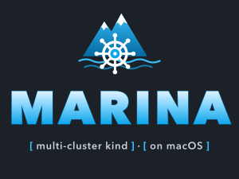
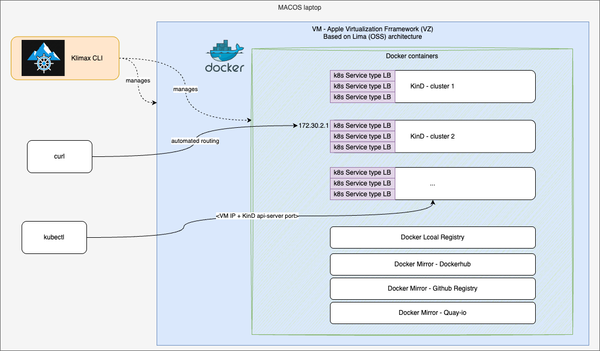

<p align="center">
  
</p>

<p align="center">
  <a href="https://marina.run"><strong>🌐 marina.run</strong></a>
  &nbsp;&middot;&nbsp;
  <a href="https://marina.run/docs/"><strong>📚 Documentation</strong></a>
  &nbsp;&middot;&nbsp;
  <a href="https://marina.run/docs/getting-started.html"><strong>🚀 Getting started</strong></a>
  &nbsp;&middot;&nbsp;
  <a href="https://marina.run/docs/cli-reference.html"><strong>📖 CLI reference</strong></a>
</p>

_Fast, efficient, and opinionated multi-cluster manager for macOS Silicon laptops._

**marina** is an dependency-free CLI that manages a macOS Virtualization.framework (VZ) Lima VM, installs Docker inside it, creates and manages multiple [kind](https://kind.sigs.k8s.io/) clusters, and wires up pure L3 routing from your Mac into the kind bridge subnet — no SNAT, no VPN, direct IP access to pods and LoadBalancer services.

Marina is self-contained, clean, and can work alongside your current Docker setup without conflict (Orbstack, Colima, Rancher Desktop, etc.). More details below.



For lower-level design, see [docs/MARINA-LLD-architecture.png](docs/MARINA-LLD-architecture.png)
and the [Architecture guide](https://marina.run/docs/architecture.html).

---

## Table of contents
- [Documentation](#documentation)
- [Demo](#demo)
- [Prerequisites](#prerequisites)
- [Installation](#installation)
- [Quick start](#quick-start)
- [What it does](#what-it-does)
- [Configuration reference](#configuration-reference)
- [CLI reference](#cli-reference)
- [Networking deep-dive](#networking-deep-dive)
- [Running alongside Orbstack, Rancher Desktop, or Colima](#running-alongside-orbstack-rancher-desktop-or-colima)
- [Project layout](#project-layout)


---

## Documentation

This README is the quick tour. The full documentation lives at
**[marina.run/docs](https://marina.run/docs/)**:

| Guide | What it covers |
|---|---|
| [Getting started](https://marina.run/docs/getting-started.html) | Install marina, bring up the VM, create your first routable kind cluster |
| [Managing clusters](https://marina.run/docs/managing-clusters.html) | Create, list, switch, label, verify, and delete individual clusters |
| [Fleet management](https://marina.run/docs/fleet.html) | Declaratively create and tear down whole fleets from one manifest |
| [Fleet resource reference](https://marina.run/docs/fleet-reference.html) | Every field of the `marina.run/v1alpha1` Fleet manifest, with defaults and validation rules |
| [Configuration](https://marina.run/docs/configuration.html) | `~/.marina/config.yaml` — VM size, bridge CIDR, kind versions, DNS, mirrors |
| [CLI reference](https://marina.run/docs/cli-reference.html) | Every command and flag |
| [Registry mirrors](https://marina.run/docs/registries.html) | Pull-through caches, dodging Docker Hub rate limits, adding your own mirror |
| [Networking &amp; L3 routing](https://marina.run/docs/networking.html) | vzNAT, the host route, `ip_forward`, and the iptables SNAT exemptions |
| [Helm with marina](https://marina.run/docs/helm.html) | Charts with LoadBalancer services, reachable from your Mac via MetalLB |
| [Architecture](https://marina.run/docs/architecture.html) | How the VM, Docker, kind, MetalLB, CoreDNS, and mirrors fit together |
| [Upgrading](https://marina.run/docs/upgrading.html) | Upgrade without losing your image cache or config |
| [Reset &amp; reinstall](https://marina.run/docs/reset.html) | Three levels, from rebuilding the VM to a full clean install |
| [Marina UI](https://marina.run/docs/marina-ui.html) | The native SwiftUI companion app |
| [Agent Skill](https://marina.run/docs/agent-skill.html) | Teach AI coding tools to drive marina |
| [marina as a Docker host](https://marina.run/docs/docker-host.html) | Use the VM's Docker daemon on its own, with published ports on `localhost` and Hub pulls through the cache |
| [marina vs. other tools](https://marina.run/docs/comparison.html) | How it lines up against Rancher Desktop, Colima, and OrbStack — including what they do better |
| [Changelog](https://marina.run/docs/changelog.html) | Release history |

---

## Demo

[](https://asciinema.org/a/oNo5GJ5uj96JE0G2?speed=1.5&autoplay=1)

---

## Prerequisites

### On your Mac (host)

- **macOS 13 Ventura or later** — Apple Virtualization.framework is required (`vmType: vz`)
- **`sudo` access** — needed only when `marina up` first adds the macOS route (re-runs skip it if already correct) and for `marina destroy`; `marina down` does not require sudo
- **Go 1.26+** — only if building from source; not needed for the pre-built binary (the exact floor is the `go` directive in [go.mod](go.mod), which `go mod tidy` derives from the dependency graph)
- **kubectx** (optional) — for easier kubeconfig context switching, or use `marina kubeconfig use <name>`

> marina is self-contained. On first `marina up` it automatically downloads and caches the Lima guest agent binary. No separate Lima installation required.

### Inside the VM (auto-provisioned by `marina up`)

| Tool | Version | Purpose |
|---|---|---|
| Docker | latest via get.docker.com | Container runtime for kind and registries |
| kind | v0.32.0 | Kubernetes-in-Docker cluster manager |
| kubectl | latest stable | Cluster management from within the VM |
| jq, iptables, curl, net-tools, python3 | distro packages | Tooling for scripts and routing rules |

---

## Installation

> 📚 Full guide: [Getting started](https://marina.run/docs/getting-started.html)

### Homebrew (recommended)

```sh
brew tap bcollard/marina
brew trust --tap bcollard/marina
brew install --cask marina
```

### Coming from klimax

marina was called **klimax** before v1.0. Moving over is one command:

```sh
brew update && brew upgrade --cask klimax   # installs marina; `klimax` stays as an alias for now
marina migrate                              # deletes the klimax VM, moves the config and registry cache
marina up
```

What changes for you: hostnames `*.klimax.internal` → `*.marina.internal`, the fleet label `klimax.dev/fleet` → `marina.run/fleet`, Fleet manifests' `apiVersion` → `marina.run/v1alpha1`, and a new local CA to trust (one sudo prompt). Clusters are re-created; cached images are not downloaded again. `marina migrate --dry-run` shows the plan first.

### Upgrading

> 📚 Full guide: [Upgrading marina](https://marina.run/docs/upgrading.html)

```sh
brew upgrade --cask marina
```

> ⚠️ **Rebuild the VM after upgrading.** marina bakes a specific kind CLI and
> default Kubernetes node image into the VM at creation time; upgrading the binary
> does **not** re-provision an existing VM. After a `brew upgrade`, run:
>
> ```sh
> marina destroy && marina up
> ```
>
> then recreate your clusters (`marina cluster create <name>`). Skipping this can
> leave you on an older kind that cannot create the new default node version.

### Build from source

CGO is required because Lima's VM management packages link against macOS frameworks:

```sh
git clone https://github.com/bcollard/marina
cd marina
CGO_ENABLED=1 go build -o marina ./cmd/marina
sudo mv marina /usr/local/bin/
```

### Shell completion

```sh
# zsh (add to ~/.zshrc for persistence)
source <(marina completion zsh)

# bash
source <(marina completion bash)

# fish
marina completion fish > ~/.config/fish/completions/marina.fish
```

---

## Quick start

> 📚 Walkthrough with explanations: [Getting started](https://marina.run/docs/getting-started.html)

```sh
# 1. Bring up the VM + Docker + networking + registries
marina up # prompts for sudo once to add the macOS route; re-running up on a live VM skips it and won't prompt again

# 2. Create a kind cluster
marina cluster create dev

# 3. Use the cluster (kubeconfig auto-merged into ~/.kube/config)
kubectl config use-context dev
# or: kubectx dev

# 4. Test cluster connectivity by deploying nginx and exposing it with a LoadBalancer service (MetalLB will assign a VIP in the kind bridge subnet)
marina cluster e2e-test-nginx
# additionally, you can run a curl command from your Mac directly to the MetalLB VIP without port-forwarding:
# kubectl get svc nginx -o jsonpath='{.status.loadBalancer.ingress[0].ip}' # get VIP; by default in the 172.30.0.0/16 subnet
# curl http://<VIP>/ # should return the nginx welcome page

# 5. Create a second cluster
marina cluster create staging

# 6. List all clusters
marina cluster list

# 7. Delete one or more clusters
marina cluster delete # with interactive picker (space to select)

# 8. Stop the VM when you're done (preserves clusters and registry cache)
marina down

# 9. Destroy the VM and all clusters when you no longer need them
marina destroy # this also removes the macOS route, so sudo is required
```

After `marina up`, the kind bridge CIDR is routed from your Mac directly to the VM. You can reach any pod IP, Service ClusterIP, or MetalLB LoadBalancer IP without port-forwarding.


---

## What it does

| Concern | What marina does |
|---|---|
| VM | Creates/starts/stops/deletes a Lima VZ instance |
| Docker | Installs Docker in the VM; forwards the socket to `~/.<vmname>.docker.sock` |
| kind | Creates/deletes multiple kind clusters; each gets its own subnet slice and API port |
| Registries | Runs pull-through mirrors for docker.io, quay.io, gcr.io, and Google Artifact Registry (us-docker.pkg.dev, us-central1-docker.pkg.dev); mirror data cached persistently |
| Networking | Routes `kindBridgeCIDR` from macOS → VM via `lima0`; no SNAT so source IPs are preserved |
| MetalLB | Installed in every cluster with a dedicated IP pool slice |
| CoreDNS | Adds custom domain forwarding (e.g. `runlocal.dev`) at cluster creation |
| Local DNS | Publishes every LoadBalancer Service as `<service>.<namespace>.<cluster>.marina.internal`, resolvable from the Mac, the VM and pods — no domain needed (ExternalDNS → etcd → CoreDNS, `/etc/resolver` on the Mac) |
| kubeconfig | Exports per-cluster kubeconfig to `~/.kube/marina/<name>.kubeconfig`; auto-merges into `~/.kube/config` |


---

## Configuration reference

> 📚 Full reference: [Configuration](https://marina.run/docs/configuration.html)

The default config path is `~/.marina/config.yaml`. Use `marina config edit` to open it in your `$EDITOR`, or copy `config.example.yaml` to get started.

```yaml
# ── VM ──────────────────────────────────────────────────────────────────────
vm:
  name: "marina"         # Lima instance name; Docker socket at ~/.<name>.docker.sock
  # cpus and memory default to a share of this Mac — 3/4 of the cores and half
  # the RAM. Set them to pin a value.
  # cpus: 8           # 10-core M1 Pro -> 8
  # memory: "16GiB"   # 16GiB -> 8GiB, 32GiB -> 16GiB, 64GiB -> 32GiB
  disk: "20GiB"       # default; grow later with: marina disk resize 40GiB
  imageDisk: "30GiB"  # default; persistent image store, survives `marina destroy`
  # caCerts:            # extra CAs — TLS-intercepting proxy, private registry
  #   files: ["~/corp-root-ca.pem"]
  # rosetta: false      # enable Rosetta 2 for amd64 containers (ARM64 only)

  # Host directories shared into the guest over virtiofs. Empty by default.
  # Each appears in the VM at the same absolute path, which is what makes a
  # host-path `docker run -v ~/projects/conf:/etc/app` bind resolve.
  mounts: []
  # mounts:
  #   - location: "~/projects"
  #     writable: true          # default false

# ── Networking ───────────────────────────────────────────────────────────────
network:
  kindBridgeCIDR: "172.30.0.0/16"   # routed from macOS → VM; no SNAT
  # proxy:                          # optional; macOS system proxy is used by default
  #   http:  "http://proxy.corp:3128"
  #   https: "http://proxy.corp:3128"
  #   noProxy: ["*.corp.example"]   # appended to the list marina computes

  # Defaults to true: Lima's TCP port mirroring is disabled, so marina coexists with
  # other Lima VMs (kind-on-lima, Rancher Desktop) that also manage kind clusters —
  # otherwise two VMs racing to mirror the same port (e.g. 7001) to 127.0.0.1 conflict.
  # With disablePortMirroring: true, kubeconfigs use the VM's direct lima0 IP instead
  # of 127.0.0.1. Set to false to force loopback (127.0.0.1) — e.g. host security
  # software (CrowdStrike) blocking vzNAT IPs. ⚠ VM-level: only takes effect on new
  # VMs (marina destroy && up).
  # disablePortMirroring: true

  dns:                              # local DNS for LoadBalancer Services
    enabled: true                   # default; false removes the containers, rules and resolver file
    domain: "marina.internal"       # names: <service>.<namespace>.<cluster>.<domain>
    nameTemplate: "{{.Name}}.{{.Namespace}}"   # automatic name, relative to <cluster>.<domain>
    tls:
      enabled: true                 # local CA: trusted root + a *.<cluster>.<domain> wildcard per cluster

# ── Kind defaults (applied to every `marina cluster create`) ─────────────────
kind:
  nodeVersion: "v1.36.1"
  metalLBVersion: "v0.16.1"
  customDnsResolvers:
    - domain: "runlocal.dev"          # forward to 8.8.8.8/8.8.4.4 (default resolvers)
    # - domain: "corp.internal"
    #   resolvers: ["10.0.0.53"]      # private resolver for internal zones
  autoMergeKubeconfig: true   # merge context into ~/.kube/config after create
  autoRemoveKubeconfig: true  # remove context from ~/.kube/config after delete

# ── Registries ───────────────────────────────────────────────────────────────
registries:
  # "host" (default): cache at ~/.marina/registry-cache/ — survives marina destroy
  # "guest": cache inside the VM — wiped on marina destroy
  cacheStorage: "host"

  mirrors:
    - name: "registry-dockerio"
      port: 5030
      remoteURL: "https://registry-1.docker.io"
      # username/password: optional, avoids Docker Hub rate limits

    - name: "registry-quayio"
      port: 5010
      remoteURL: "https://quay.io"

    - name: "registry-gcrio"
      port: 5020
      remoteURL: "https://gcr.io"

    - name: "registry-us-docker-pkgdev"
      port: 5040
      remoteURL: "https://us-docker.pkg.dev"

    - name: "registry-us-central1-docker-pkgdev"
      port: 5050
      remoteURL: "https://us-central1-docker.pkg.dev"
```

> Cluster lifecycle is managed exclusively via `marina cluster` subcommands — there is no cluster list in the config file.

---

## CLI reference

> 📚 Every command and flag: [CLI reference](https://marina.run/docs/cli-reference.html)

```
marina [--config ~/.marina/config.yaml] [--debug] [--lima-log-level <level>] <command>
```

By default only marina's own logs are shown; the underlying Lima VM logs are
hidden. Use `--lima-log-level trace|debug|info|warn|error|off` to surface them
(or `--debug`, which shows Lima at `info`).

### VM lifecycle

| Command | Description |
|---|---|
| `marina up` | Create/start the VM, provision Docker, set up networking and registries (idempotent). Alias: `marina start` |
| `marina down` | Stop the VM — preserves all clusters and registry cache data. Aliases: `marina stop`, `marina d` |
| `marina down --remove-route` | Stop the VM and remove the macOS host route (requires sudo) |
| `marina destroy` | Stop + delete VM, delete all clusters, remove host route |
| `marina status` | Show VM state, host mounts, clusters, route, and iptables rule presence (`-o text\|json\|yaml`) |
| `marina doctor` | Diagnose common issues (VM, route, iptables, IP forwarding, Rosetta); `--fix` applies what marina can repair, `-o text\|json\|yaml` |
| `marina version` | Print the marina version |
| `marina shell` | Open an interactive SSH session in the VM |
| `marina shell <cmd> [args...]` | Run a command in the VM and exit with its exit code |
| `marina copy <src>... <dst>` | Copy files between host and VM (`vm:` marks the VM side; `-r` for directories) |
| `marina config edit` | Open the config file in `$VISUAL` / `$EDITOR` |
| `marina disk resize <size>` | Grow the VM disk (e.g. `80GiB`) — applied on the next VM start |
| `marina disk resize-image <size>` | Grow the persistent image-cache disk (`vm.imageDisk`) in place, keeping the cached images |
| `marina prune` | Remove reclaimable cached files (`--dry-run`, `--downloads`, `-y`) |
| `marina sudoers` | Print a sudoers snippet so `marina up` never prompts for the host route (`--check`) |
| `marina autostart install\|uninstall\|status` | Manage a launchd agent that starts the VM at login |

### Running commands and copying files

`marina shell` doubles as a non-interactive runner, so VM-side work composes in
scripts and pipelines without needing `limactl`:

```sh
marina shell docker ps                          # flags after the command are passed through
marina shell -- bash -c 'kind get clusters'     # use -- when flags could look like marina's
cat setup.sh | marina shell bash -s             # stdin is piped through
marina shell -t htop                            # -t forces a pseudo-terminal
```

The exit code is the remote command's, so `if marina shell test -e /run/docker.sock; then ...` works.

```sh
marina copy ./script.sh vm:/tmp/script.sh       # host → VM
marina copy vm:/tmp/out.json ./out.json         # VM → host
marina copy -r ./manifests vm:/tmp/manifests    # directories
```

### Growing the disk

```sh
marina disk resize 80GiB      # updates vm.disk and the Lima instance config

# Grow the persistent image-cache disk (vm.imageDisk). Raising imageDisk in the
# config only affects a disk that does not exist yet — an existing one must be
# resized explicitly, which keeps the cached images rather than re-pulling them:
marina down
marina disk resize-image 30GiB
marina up
marina down && marina up      # Lima expands the image; the guest FS grows on boot
```

Shrinking is not supported. Node images are large (~2.7GB each), so check
headroom with `marina shell df -h /`.

### Reclaiming space

> 📚 See also: [Reset &amp; reinstall](https://marina.run/docs/reset.html) for deeper cleanups

```sh
marina prune --dry-run           # show what would go
marina prune --downloads         # also clear Lima's shared image download cache
```

It removes superseded Lima guest agents and registry cache directories whose
mirror is no longer configured. Caches of *configured* mirrors are never touched
— use `marina registry clean-cache` for those.

### Passwordless host route (and starting at login)

`marina up` needs root for exactly one thing: the macOS route for the kind bridge
CIDR. Grant just that, and `up` stops prompting:

```sh
marina sudoers | sudo tee /etc/sudoers.d/marina >/dev/null
sudo chmod 0440 /etc/sudoers.d/marina
marina sudoers --check            # inspects the sudo policy for the two rules
```

That is also what makes autostart useful, since launchd cannot answer a prompt:

```sh
marina autostart install          # runs 'marina up' at login; --print shows the plist
marina autostart status
marina autostart uninstall
```

Autostart output is appended to `~/.marina/logs/autostart.log`.

### Docker

**Option A — environment variable (current shell only)**

```sh
eval $(marina docker-env)          # export DOCKER_HOST=unix://...
eval $(marina docker-env --unset)  # unset DOCKER_HOST
```

**Option B — Docker context (persistent across shells)**

```sh
marina docker-context              # create/update "marina" context
marina docker-context --unset      # docker context use default
```

> If `DOCKER_HOST` is set it overrides the active Docker context — use one or the other. `marina docker-context` warns when both are active.

### Sharing host directories (`vm.mounts`)

The Docker daemon runs **inside the VM**, so it resolves a bind-mount source inside the VM. marina shares nothing of yours by default, and a bind for an unshared path does not fail — dockerd creates the missing directory in the guest and the container sees an **empty** directory:

```sh
# Without a matching vm.mounts entry, /etc/app is empty in the container.
docker run -v ~/projects/conf:/etc/app alpine ls /etc/app
```

List the directories you want shared, and they appear in the VM at the **same absolute path** — which is exactly what makes a host-path `-v` work:

```yaml
vm:
  mounts:
    - location: "~/projects"
      writable: true
```

```sh
marina up      # spots the change and offers to restart the VM
marina status  # shows the VM's current shares
```

| | |
|---|---|
| `location` | Host directory. `~` is expanded. Must exist — `marina up` refuses a path that doesn't, rather than letting it fail deep inside the VM start. |
| `writable` | Defaults to `false`, matching Lima. Opt in per directory. |
| `mountPoint` | Optional guest path. Leave it out unless you mean it: a guest path that differs from the host path is the one case where `-v <host path>` stops working. |

Unlike `vm.imageDisk` and `network.disablePortMirroring`, this list does **not** need the VM recreated. `marina up` compares it against the VM's current shares and offers to restart — a restart still stops every kind cluster on the VM, so it asks first, and does nothing when run non-interactively.

> **Mounts are host-directory shares only.** The VM's root disk (`vm.disk`) and the image store (`vm.imageDisk`) are virtio-blk block devices, not virtiofs mounts, and `mountType` has no bearing on them.

### Clusters

> 📚 Full guide: [Managing clusters](https://marina.run/docs/managing-clusters.html)

```sh
# Create
marina cluster create <name>
marina cluster create <name> --region us-east1 --zone us-east1-a
marina cluster create <name> -l team=platform -l env=dev   # extra node labels

# Apply a fleet from a Fleet manifest (see below)
marina cluster apply -f fleet.yaml
marina cluster apply -f fleet.yaml --dry-run
marina cluster apply -f fleet.yaml --max-parallel 3

# Delete — interactive multi-select picker when no name given
marina cluster delete <name>
marina cluster delete
marina cluster delete -f fleet.yaml --yes            # tear down a whole fleet
marina cluster delete -l env=test --yes              # delete by label selector

# List
marina cluster list
marina cluster list -o json
marina cluster list -l marina.run/fleet=dev-fleet    # filter by label selector

# Label an existing cluster's nodes
marina cluster label <name> -l team=platform -l env=prod   # set/overwrite
marina cluster label <name> -l env-                        # remove

# Kubeconfig
marina kubeconfig use <name>            # merge + switch active kubectl context to it
marina kubeconfig merge <name>          # merge into ~/.kube/config (don't switch)
eval $(marina kubeconfig env <name>)    # or point KUBECONFIG at the isolated file
marina kubeconfig path <name>           # print the kubeconfig file path
marina kubeconfig remove <name>         # remove the context from ~/.kube/config

# E2E smoke test (uses current kubectl context)
marina cluster e2e-test-nginx
marina cluster e2e-test-nginx --cleanup   # remove nginx pod/svc only
```

The interactive delete picker supports multi-select:

```
Delete kind clusters (↑/↓ navigate · Space toggle · a=all · Enter confirm · q quit)

  [ ] dev       port 7001
  [x] staging   port 7002
  [x] prod      port 7003

  2 cluster(s) selected — press Enter to delete
```

### Fleets — `marina fleet`

> 📚 Full guide: [Fleet management](https://marina.run/docs/fleet.html) &middot; every manifest field: [Fleet resource reference](https://marina.run/docs/fleet-reference.html)

Create and manage several clusters at once from a declarative **Fleet** manifest.
The minimal manifest lists only names — everything else defaults:

```yaml
# fleet.yaml
apiVersion: marina.run/v1alpha1
kind: Fleet
metadata:
  name: dev-fleet
spec:
  clusters:
    - dev
    - staging
```

```sh
marina fleet create -f fleet.yaml         # create the clusters (--dry-run to preview, --max-parallel N)
marina fleet list                         # show fleets and their member clusters
marina fleet describe dev-fleet           # members with num, ports, node version/readiness, labels
marina fleet export dev staging > f.yaml  # capture live clusters as a Fleet manifest
marina fleet export -l env=dev            # ...by label selector
marina fleet export                       # ...or pick them interactively
marina fleet label dev-fleet -l tier=gold # label every cluster in the fleet (key- to remove)
marina fleet delete dev-fleet --yes       # delete every cluster in the fleet
marina fleet delete -f fleet.yaml --yes   # ...or tear down exactly what the manifest lists
marina fleet adopt dev-fleet legacy1      # pull an existing standalone cluster into the fleet
```

If `fleet create` finds a listed cluster that already exists but isn't part of the
fleet, it **warns and skips** it (never silently relabels). Re-run with `--adopt`
to pull those clusters into the fleet, or use `marina fleet adopt <fleet> <cluster>…`.

Fleet membership is tracked by the `marina.run/fleet=<name>` node label, so
`fleet list/label/delete` work on the live clusters regardless of the manifest.

`create` is **additive**: clusters that already exist are skipped. Each entry can
optionally set `dependsOn` (ordering), `num`, `nodeVersion`, `region`/`zone`,
`registries` (cherry-pick mirrors),
`addons.metricsServer`, and `labels`. Independent clusters build in parallel up to
`spec.maxParallel`; `dependsOn` is always respected. See
[`examples/fleet.yaml`](examples/fleet.yaml) for the full reference.

> `marina cluster apply -f` / `cluster delete -f` remain as lower-level equivalents
> of `fleet create` / `fleet delete -f`.

### Per-cluster resources (derived from the auto-assigned cluster num)

| Resource | Value |
|---|---|
| API server host port | `700N` (e.g. `7001` for num 1) |
| Service subnet | `10.N.0.0/16` |
| Pod subnet | `10.1N.0.0/16` |
| MetalLB pool | `<kindPrefix>.N.1–7` and `<kindPrefix>.N.16–254` |
| kubeconfig | `~/.kube/marina/<name>.kubeconfig` |
| topology labels | `topology.kubernetes.io/region=europe-westN`, `zone=europe-westN-b` |
| default node labels | `managed-by=marina` (always); `marina.run/fleet=<name>` (via `apply -f`); plus any `-l key=value` / Fleet `labels` |

### Registries

> 📚 Full guide: [Registry mirrors](https://marina.run/docs/registries.html)

```sh
marina registry clean-cache   # remove all mirror cache dirs + containers; run 'marina up' to restart
```

Mirror cache data is stored at `~/.marina/registry-cache/<mirror-name>/` by default (`cacheStorage: "host"`), virtiofs-mounted into the VM and bind-mounted into each registry container. Blobs survive `marina down`/`up` cycles and even `marina destroy`.

### Local DNS (`network.dns`)

Every LoadBalancer Service gets a name, with no domain to buy and no DNS provider:

```sh
marina cluster create dev
kubectl create deploy web --image=nginx && kubectl expose deploy web --port 80 --type LoadBalancer
curl http://web.default.dev.marina.internal/      # from the Mac, the VM, or any pod

marina dns list                     # every published name and its VIP (-o json|yaml)
marina dns attach <cluster>...      # add a cluster created before network.dns was on
```

- **Names:** `<service>.<namespace>.<cluster>.marina.internal` automatically, for LoadBalancer Services only — ClusterIP, headless and NodePort Services are not published (their addresses are not reachable from the Mac). Add a custom one with the annotation `external-dns.kubernetes.io/hostname: app.dev.marina.internal` (it must sit under the cluster's own zone). Ingress hosts under `*.<cluster>.marina.internal` are published too.
- **How:** `marina up` runs etcd and CoreDNS on the kind network (`172.30.255.52` / `.53`); each cluster runs ExternalDNS, which writes its Services into etcd; `/etc/resolver/marina.internal` sends the Mac's lookups to CoreDNS through the existing host route. The resolver file needs **sudo once** — its address never changes, so it is never rewritten.
- **Fleet-wide names:** members of a [fleet](#fleets--marina-fleet) can also publish under `<fleet>.marina.internal` — annotate a Service with `external-dns.kubernetes.io/hostname: gateway.lab.marina.internal`. The first member to publish a name owns it; if that member is deleted, another member that claims the name takes it over. A fleet and a cluster may not share a name (both would own `<name>.marina.internal`).
- **Turn it off** with `network.dns.enabled: false` and `marina up`: the containers, the iptables exemption and the resolver file are removed.
- **A new name appears within ~15 s** (ExternalDNS's sync interval). Don't look it up before then: macOS keeps a "no such name" answer for about 75 s, whatever the zone's TTL says. `marina dns list` shows when it is published; `sudo killall -HUP mDNSResponder` clears the cache.
- **Caveats:** tools that do their own DNS skip `/etc/resolver` — `dig` (use `dig @172.30.255.53` or `dscacheutil -q host -a name <name>`), Go programs built with the pure-Go resolver, and Chrome with a custom Secure DNS provider. No public CA issues certificates for `.internal`; use a private CA.

### HTTPS on local names (`network.dns.tls`)

marina runs its own CA for the zone — no mkcert, no homepki binary, no cert-manager required:

```sh
marina up                                  # creates the root, trusts it in the System keychain (sudo, once)
marina cluster create dev                  # issues *.dev.marina.internal → Secret default/marina-wildcard-tls
curl https://shop.dev.marina.internal/     # serve that Secret; browsers trust it
```

| Command | What it does |
|---|---|
| `marina ca status [-o json\|yaml]` | Root path, expiry, keychain trust, each cluster's wildcard |
| `marina ca cert` | Print the root (PEM) — e.g. for a pod's trust store |
| `marina ca attach <cluster>...` | Issue/renew a cluster's wildcard; adds a `marina-ca` ClusterIssuer when cert-manager is installed |
| `marina ca secret <cluster> -n <ns> [--fleet]` | Copy the cluster's (or, with `--fleet`, its fleet's) wildcard Secret into another namespace |
| `marina ca trust` / `untrust` | Add or remove the root's keychain trust (sudo) |

- **Constrained by design.** The root may only issue under `.marina.internal` and each cluster's intermediate only under `.<cluster>.marina.internal`, so trusting the root cannot be abused for any other site. The root's key never leaves `~/.marina/pki/`.
- **One label.** `*.dev.marina.internal` covers annotated names and Ingress hosts (`shop.dev.marina.internal`), not the automatic `web.default.dev.marina.internal`. For those, use cert-manager with the `marina-ca` ClusterIssuer, or set `nameTemplate: "{{.Name}}-{{.Namespace}}"`.
- **Fleets** get their own intermediate, constrained to `.<fleet>.marina.internal`, and a `*.<fleet>.marina.internal` wildcard in every member as `default/marina-fleet-wildcard-tls` (plus a `marina-fleet-ca` ClusterIssuer with cert-manager). Neither a member's intermediate nor the fleet's can sign for the other's zone.
- **Upgrading from v0.2.2/0.2.3:** run `marina ca attach <cluster>` on each cluster. Those versions issued certificates macOS rejects (a name-constraint quirk in Apple's verifier); `attach` re-issues and re-installs them.
- **Pods** trust the root once it is mounted: the ConfigMap `default/marina-root-ca` holds it.
- `marina destroy` keeps the root (like the registry cache); cluster intermediates are removed with their clusters.

### AI coding tools (Agent Skill)

> 📚 Full guide: [Agent Skill for AI coding tools](https://marina.run/docs/agent-skill.html)

marina ships an [Agent Skill](https://code.claude.com/docs/en/skills) that teaches AI coding tools how to drive marina — spinning up ephemeral kind clusters for scripts, demos, and e2e tests. Install it once and every future agent session knows how to use marina without you explaining it each time:

```sh
marina skill install          # → ~/.claude/skills/marina/SKILL.md
marina skill install --force  # overwrite an existing copy (e.g. after upgrading marina)
marina skill path             # print the install path
marina skill install --print  # emit the skill to stdout (pipe it anywhere)
```

The skill is embedded in the binary, so no download is needed. Start a new agent session after installing to pick it up.

---

## Networking deep-dive

> 📚 Full guide: [Networking &amp; L3 routing](https://marina.run/docs/networking.html)

```
macOS host
  bridge1xx (<host-IP>, macOS-assigned)
      │  vzNAT — Apple VZNATNetworkDeviceAttachment
      ▼
Lima VZ guest
  lima0 (<guest-IP>, macOS-assigned)
  br-<id> (172.30.0.1/16)  ← Docker bridge "kind"
      │
  kind cluster nodes (172.30.N.x)
```

> vzNAT IPs are assigned by macOS and cannot be configured. marina detects the VM's `lima0` IP at runtime — nothing is hardcoded. Multiple Lima VMs (marina, limactl, colima…) each get a distinct IP on their own `bridge1xx`, so they coexist without conflict.

### How pure L3 routing works

1. `marina up` adds a macOS route: `172.30.0.0/16 → <lima0-IP>` (via `sudo /sbin/route`).
2. Inside the VM, `ip_forward=1` and a systemd oneshot apply iptables rules idempotently:
   - **nat exemption** (before Docker's MASQUERADE): kind→host traffic exits `lima0` without SNAT.
   - **DOCKER-USER forward rules**: host→kind and established returns are explicitly allowed.
3. A `docker.service.d` drop-in reruns the rules after every Docker restart.

The result: `curl http://172.30.1.200/` on your Mac reaches the MetalLB VIP directly.

### kubeconfig and API server access

marina supports two modes for kubeconfig API server addresses:

**Default (direct IP mode — `network.disablePortMirroring: true`)**

Lima's TCP port mirroring is disabled for the marina VM, so marina coexists cleanly with other Lima-based VMs (kind-on-lima, Rancher Desktop) that also manage kind clusters — otherwise two VMs racing to mirror the same port (e.g. `7001`) to `127.0.0.1` conflict. Kubeconfigs use the VM's direct `lima0` IP (e.g. `192.168.64.3:700N`), which is L2-reachable from the host via vzNAT. The API server cert automatically includes the lima0 IP as a SAN.

> Note: the lima0 IP is assigned dynamically by macOS and may change on VM restart. Run `marina kubeconfig merge <name>` after a restart to refresh the address in `~/.kube/config`.

**Loopback mode (`network.disablePortMirroring: false`)**

Cluster API servers listen on `0.0.0.0:700N` inside the VM. Lima's hostagent forwards these ports to `127.0.0.1:700N` on the host, and exported kubeconfigs point at `https://127.0.0.1:700N` — a stable address that survives VM restarts. Use this when running only a single marina VM, or when host-based security software (e.g. endpoint agents like CrowdStrike) blocks direct vzNAT IP access.

This is a VM-level setting — it only takes effect on new VMs (`marina destroy && marina up`).

### Registry mirrors

Every kind cluster is configured via containerd patches to cache pulls from docker.io, quay.io, gcr.io, and Google Artifact Registry (us-docker.pkg.dev, us-central1-docker.pkg.dev) transparently through pull-through mirrors, avoiding rate limits and accelerating cluster creation.

All mirror containers are attached to the `kind` Docker network so cluster nodes resolve them by hostname.

---

## Running alongside Orbstack, Rancher Desktop, or Colima

> 📚 Feature-by-feature comparison: [marina vs. other tools](https://marina.run/docs/comparison.html)

marina is designed to coexist with other Lima-based tools on the same Mac. Each Lima VM gets
its own vzNAT interface (`bridge1xx`) and a distinct macOS-assigned IP, so there is no
IP-level conflict between VMs.

The one friction point would be **Lima's TCP port mirroring**: Lima's hostagent can
forward every TCP port that a process in the VM listens on to `127.0.0.1` on the host. When
two VMs independently manage kind clusters, both hostagents would try to mirror the same
API-server ports (e.g. `7001`) to `127.0.0.1` simultaneously, breaking connectivity for both.

**marina bypasses this by default** — `network.disablePortMirroring` is `true`:

```yaml
# ~/.marina/config.yaml
network:
  disablePortMirroring: true   # default
```

With this setting (the default):
- Lima does not forward any TCP port from the marina VM to `127.0.0.1`.
- Cluster kubeconfigs use the VM's direct `lima0` IP (e.g. `https://192.168.64.3:7001`) — reachable from the host over vzNAT without any routing or VPN.
- The API server cert automatically includes the `lima0` IP as a SAN, so TLS verification works out of the box.
- Every other Lima VM (Rancher Desktop, Colima, kind-on-lima) keeps forwarding its own ports to `127.0.0.1` completely unaffected.

This is a VM-level setting — it is applied when the VM is created. (Set it to `false` before
`marina up` if you need stable `127.0.0.1` kubeconfigs or your host security software blocks
vzNAT IPs.)

> The `lima0` IP is assigned dynamically by macOS and may change on VM restart.
> Run `marina kubeconfig merge <name>` after a restart to refresh kubeconfigs.

See [docs/marina-vs-other-lima-based-tools.md](docs/marina-vs-other-lima-based-tools.md) for
a detailed comparison with Rancher Desktop, Colima, and kind-on-lima, and
[docs/marina-vs-orbstack.md](docs/marina-vs-orbstack.md) for OrbStack — which includes an
honest list of what OrbStack does better.

---

## Project layout

> 📚 How the runtime pieces fit together: [Architecture](https://marina.run/docs/architecture.html)

```
marina/
├── cmd/marina/              # main entrypoint
├── internal/
│   ├── cli/                 # Cobra commands
│   ├── config/              # YAML schema, defaults, validation
│   ├── vm/                  # Lima instance manager + guest agent download
│   ├── limatemplate/        # Builds limatype.LimaYAML (VZ, mounts, provision script)
│   ├── guest/               # SSH client for running commands/scripts in the VM
│   ├── docker/              # Docker network management in guest
│   ├── registry/            # Pull-through mirror lifecycle
│   ├── kind/                # kind cluster create/delete/list; MetalLB, CoreDNS, kubeconfig
│   └── routing/             # iptables no-NAT rules; macOS route management
├── config.example.yaml
├── .goreleaser.yaml
└── Makefile
```

---

## License

MIT
